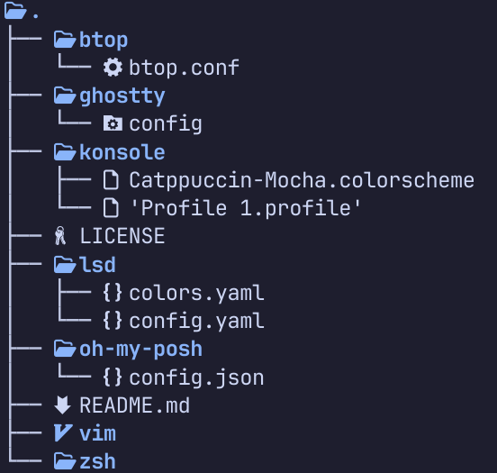
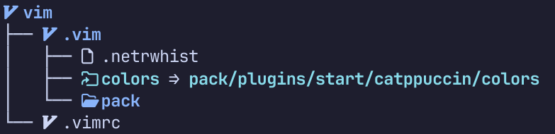

# dotfiles

> Repository for my personal configuration files.

I make use of [stow](https://www.gnu.org/software/stow/) to keep my configuration files organised in one place.
There are many ways to make use of this tool and they are more than documented on the too many blog posts out there,
this one is just my approach.

## Structure

Each directory is named after a tool I use (or have used in the past) and it contains all its configuration files:



This directories are called **packages** and in some cases they might have multiple files and/or (sub)directories:



## Usage

The best way to understand how to use this is reading the **stow** documentation.
This is how I usually do it:

On a fresh install:

```
stow -d path/to/dotfiles-repository/ -t path/to/target-directory/ -S <package-name>
```

Where `path/to/dotfiles-repository` is the relative path to this project repository clone from my current working directory,
`path/to/target-directory/` is the relative path to the directory where the configuration files for some tool should be.
The former can be dependent on your distribution and, in some cases, there are more than one place where the program looks
for configuration files.

Finally the option `-S <package-name>` will create the corresponding symbolic links for the specified package and thus making
its configuration effective.

If I am updating the packages I would use the option `-R` instead.
When moving an existing configuration to the dotfiles project I use the `--adopt` option. This should be used carefully, as the
command documentation implies.

There are many other useful options like `--simulate`. For further information and detailed description of concepts and usage,
please read the **stow** man pages.
